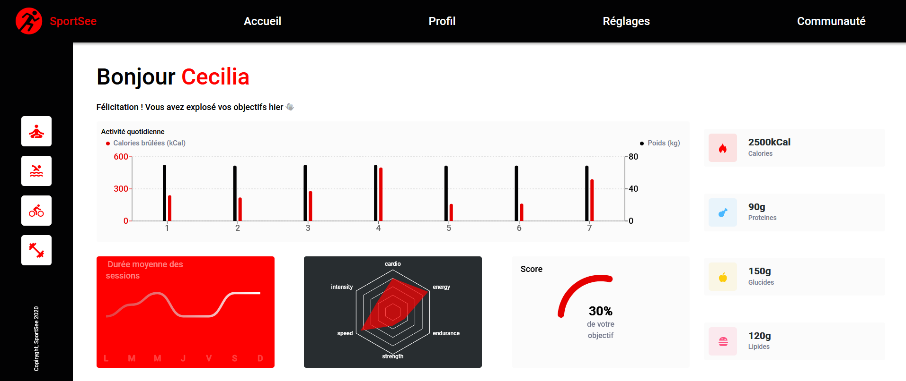

## Table des matières
1. [Informations générales](#general-info)
2. [Capture d'écran](#Capture d'écran)
2. [Technologies](#technologies)
3. [Installation](#installation)
### Informations générales
***
Contenu du projet 12 ```Développez un tableau de bord d'analytics avec React``` dans le cadre de ma formation ``     Développeur d'application - JavaScript React`` proposée par OpenClassrooms. 
### Capture d'écran
***

## Technologies
***
Voila la liste des tachnologies et leur versions utilisées dans cet application :
* [NVM](https://github.com/coreybutler/nvm-windows/releases/tag/1.1.10): Version 1.1.10
* [React](https://github.com/facebook/react/releases/tag/v18.2.0): Version 18.2.0
* [Sass](https://github.com/sass/dart-sass/releases/tag/1.71.1): Version 1.71.1
* [Recharts](https://github.com/recharts/recharts/releases/tag/v2.12.3): Version 2.12.3
## Installation
***
Voici comment installer et faire tourner l'application en local :
```
$ git clone https://github.com/steflebelge/sportsee.git
$ cd sportsee
$ nvm use 18.17.1
$ npm install
$ npm start
```

Depuis le fichier src/utils/apiCommunication.js il est possible de switcher entre l'utilisation du backend en local (dans ce cas mettre a jour la variable ``urlApi`` de la fonction ``fetchData``) ou le mockage de l'API via la fonction ``fakeFetch`` qui requete les fichiers JSON directement. Pour changer de methode il suffit de commenter/décommenter l'appel aux fonctions concernées dans le retour principal de la fonction fetchData.
